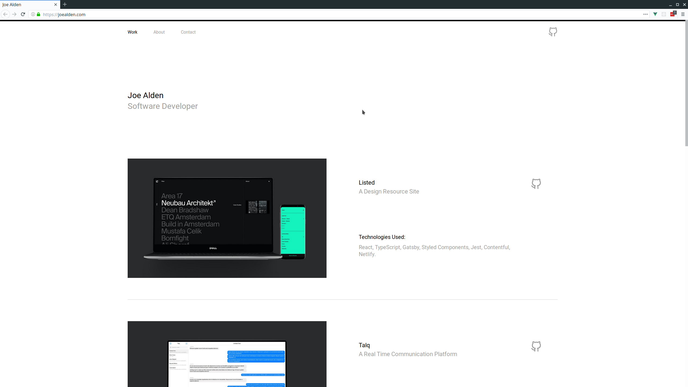

<h1 align="center">Joe Alden's Portfolio</h1>
<p align="center">My Portfolio.</p>



## Setup

Download dependencies:

```bash
yarn
```

Start development server:

```bash
yarn dev
```

Build production files:

```bash
yarn build
```

## Tech Used

- Vue
- Vue CLI 3
- Vue Router
- SCSS

## Notes

- Using vue-router history mode for cleaner URLs.
- robots.txt + web manifest for better SEO and PWA adherence.
- Auto image compression in production builds only with `image-webpack-loader`.
- Syncronously download all pages so that page navigations are fast.
